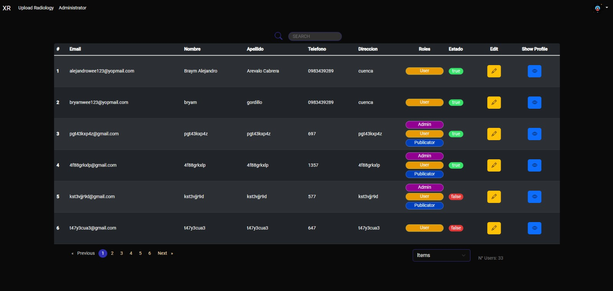

# Interfaz Gráfica para el Proyecto de Detección de Enfermedades Pulmonares

¡Bienvenido a la interfaz gráfica de nuestro emocionante proyecto de detección de enfermedades pulmonares y conversión de imágenes médicas! En esta interfaz, hemos implementado una solución basada en Angular que permite visualizar de manera gráfica las regiones donde se encuentran las enfermedades pulmonares detectadas, junto con los porcentajes representativos de cada enfermedad. Además, hemos integrado un módulo de administración de usuarios para gestionar el acceso y los permisos de los profesionales médicos.

## Características Destacadas de la Interfaz

- **Visualización Gráfica de Enfermedades:** Utilizando datos generados por el motor de detección de enfermedades, presentamos una visualización gráfica en la que se destacan las regiones afectadas por diversas enfermedades pulmonares. Esto permite a los profesionales médicos identificar rápidamente las áreas de preocupación.

- **Representación Gráfica de Porcentajes:** Junto a la visualización de enfermedades, presentamos porcentajes gráficos que representan la extensión de cada enfermedad en la imagen médica. Esto ayuda a los médicos a comprender la gravedad y la distribución de las enfermedades en el pulmón.

- **Módulo de Administración de Usuarios:** Hemos incorporado una sección de administración de usuarios que permite a los administradores gestionar cuentas de médicos y otros profesionales de la salud. Pueden crear cuentas, asignar roles y supervisar el acceso a la plataforma.

- **Acceso a Imágenes y Resultados:** Los usuarios autorizados pueden acceder a las imágenes médicas procesadas y a los resultados de la detección desde la interfaz. Esto facilita un diagnóstico colaborativo y una comunicación efectiva entre profesionales.

## Instrucciones de Uso de la Interfaz

1. **Clonar el Repositorio:** Comienza por clonar el repositorio de la interfaz en tu máquina local:

   ```
   git clone https://github.com/PePeWee07/chest-xr-system-front-end.git
   ```

2. **Instalar Dependencias:** Navega al directorio del proyecto de la interfaz y ejecuta:

   ```
   npm install
   ```

3. **Configurar API:** Asegúrate de que la API del proyecto de detección de enfermedades pulmonares esté en funcionamiento y configura la URL de la API en el archivo de configuración.

4. **Ejecutar la Aplicación:** Utiliza el siguiente comando para ejecutar la interfaz en tu navegador:

   ```
   ng serve
   ```

5. **Acceder a la Interfaz:** Abre tu navegador web y navega a `http://localhost:4200` para acceder a la interfaz gráfica. Inicia sesión con tus credenciales (o crea una cuenta si eres un administrador) para explorar las características de la interfaz.


### Vista Previa del Proyecto


#### Subida de Imágenes y Convertidor


En esta vista previa, los profesionales médicos tendrán la capacidad de cargar radiografías en formato DICOM, así como de utilizar el convertidor de imágenes para transformar archivos en formato JPG a DICOM. Este proceso es fundamental para iniciar el análisis y detección de enfermedades pulmonares a partir de imágenes médicas.

#### Visualización de Radiografía


Esta captura de pantalla muestra la interfaz de visualización de la radiografía de tórax junto con los porcentajes de probabilidad de las enfermedades más comunes. Estos porcentajes brindan a los médicos información clave sobre la gravedad y la distribución de las enfermedades, como Atelectasis, Cardiomegalia, Consolidación, Edema y Derrame pleural. Además, la ubicación de las enfermedades se representa gráficamente, lo que permite un diagnóstico más preciso.

### Ubicación de Enfermedades


En esta imagen, se presenta un modal que se expande para mostrar de manera más detallada la ubicación de las distintas enfermedades dentro de la radiografía. Esta función proporciona a los profesionales médicos la capacidad de examinar con mayor precisión las áreas afectadas y tomar decisiones informadas sobre el tratamiento.

### Módulo de Administrador

#### Administración de Usuarios



Esta vista previa muestra la interfaz de administración de usuarios, donde los administradores pueden gestionar y supervisar el acceso al sistema. Los administradores podrán ver una lista de usuarios con sus respectivos roles y detalles. Además, tendrán la opción de editar la información de los usuarios y asignar roles adecuados para garantizar una colaboración efectiva en el entorno médico.

## Contribución

Apreciamos cualquier contribución que pueda mejorar la experiencia de la interfaz gráfica. Si tienes ideas para mejorar la visualización de enfermedades, optimizar la experiencia de usuario o agregar nuevas características, no dudes en crear un fork del repositorio y enviar un pull request.

## Licencia

Esta interfaz gráfica se encuentra bajo la licencia MIT. Puedes obtener más detalles en el archivo `LICENSE` del repositorio.

Esperamos que esta interfaz facilite la colaboración médica y el análisis de imágenes médicas para la detección de enfermedades pulmonares. Si tienes alguna pregunta o sugerencia, no dudes en abrir un issue en el repositorio.

**El Equipo de Desarrollo:**
- Jose Roman
- Sebastian Quevedo
